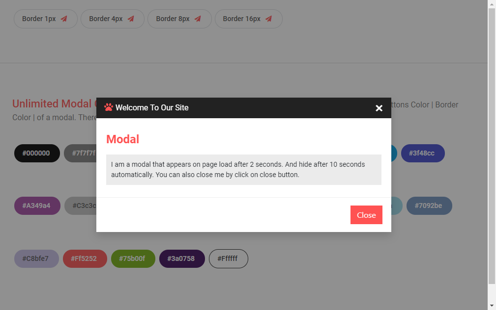

# Modal
## Entendendo o que é um modal
    Podemos compreender um modal como uma janela que sobrescreve por cima do conteúdo com informações adicionais, validação de textos ou até configuração.

   